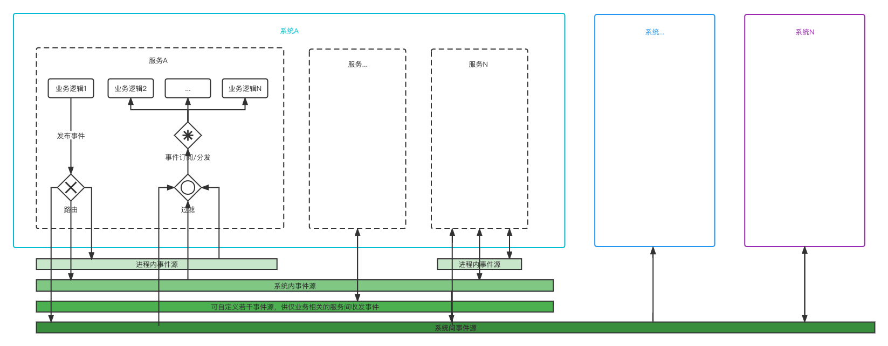

# event_bus
基于Spring易用的事件收发框架，作用如下图所示：



### 一、事件源
#### 1、SpringEventSource
基于Spring事件机制的**内存型**数据源，**事件不持久化可能丢失,消费失败不可回滚**。

适合进程内多线程间发布/消费事件的场景。

#### 2、DatabaseQueueEventSource
队列型(Queue)-事件只能被**所有订阅的客户端中的一个客户端的一个节点消费一次**。

依赖数据库操作接口QueuedEventDAO，两种实现：
##### 1）、mybatis
##### <span id = "AbstractDatabaseEventSource.mybatis.config">配置方式（以mybatis-spring为例）：</span>

A、MapperScannerConfigurer中basePackage属性增加io.github.eventbus.core.sources.impl.database.dao.mybatis包名；

B、SqlSessionFactoryBean中typeAliasesPackage属性增加io.github.eventbus.core.sources.impl.database.model包名；

C、若选择QueuedEventXmlMapper则将对应的mapper.xml文件加入SqlSessionFactoryBean的mapperLocations属性；

##### Mapper接口：

###### QueuedEventAnnotationMapper：
基于注解形式实现，相关表和操作的SQL已经定义好，可直接使用。

建表DDL：
```
CREATE TABLE `eventbus_queued_event` (
  `id` bigint unsigned NOT NULL AUTO_INCREMENT,
  `serial_id` varchar(50) COLLATE utf8mb4_unicode_ci NOT NULL,
  `name` varchar(45) COLLATE utf8mb4_unicode_ci NOT NULL,
  `message` varchar(1000) COLLATE utf8mb4_unicode_ci DEFAULT '',
  `message_type` varchar(45) COLLATE utf8mb4_unicode_ci DEFAULT '',
  `source_terminal` varchar(300) COLLATE utf8mb4_unicode_ci DEFAULT '',
  `state` tinyint(1) DEFAULT '0',
  `create_time` datetime NOT NULL,
  `update_time` datetime DEFAULT NULL,
  PRIMARY KEY (`id`),
  KEY `INDEX_state` (`state`)
) ENGINE=InnoDB DEFAULT CHARSET=utf8mb4 COLLATE=utf8mb4_unicode_ci
```
存储过程DDL：
```
CREATE DEFINER=`root`@`localhost` PROCEDURE `selectUnconsumedThenUpdateConsumedForQueued`(IN eventNames VARCHAR(1000) , v_limit INT)
BEGIN
 DECLARE v_id BIGINT DEFAULT 0;
 DECLARE v_serial_id VARCHAR(50) DEFAULT '';
 DECLARE v_name VARCHAR(45) DEFAULT '';
 DECLARE v_message VARCHAR(1000) DEFAULT '';
 DECLARE v_message_type VARCHAR(45) DEFAULT '';
 DECLARE v_source_terminal VARCHAR(300) DEFAULT '';
 DECLARE v_state TINYINT(1) DEFAULT 0;
 DECLARE v_create_time DATETIME DEFAULT NULL;
 DECLARE v_update_time DATETIME DEFAULT NULL;
 DECLARE done INT DEFAULT FALSE;

 DECLARE selectUnconsumed CURSOR FOR 
  select id,serial_id,name,message,message_type,source_terminal,state,create_time,update_time from eventbus_queued_event where state=0 and FIND_IN_SET(e.name,eventNames) limit v_limit for update;
 DECLARE CONTINUE HANDLER FOR NOT FOUND SET done = TRUE;
 
 CREATE TEMPORARY TABLE if not exists _tmp_eventbus_queued_event_(`id` BIGINT(20),`serial_id` varchar(50),`name` varchar(45),`message` varchar(1000),`message_type` varchar(45),`source_terminal` varchar(300),`state` tinyint(1),`create_time` datetime,`update_time` datetime);   
 
 SET autocommit = 0;
  OPEN selectUnconsumed;
  TRUNCATE TABLE _tmp_eventbus_queued_event_;
   FETCH selectUnconsumed INTO v_id,v_serial_id,v_name,v_message,v_message_type,v_source_terminal,v_state,v_create_time,v_update_time;
   WHILE done IS FALSE DO
    update eventbus_queued_event set state=1,update_time=now() where id=v_id;
    insert into _tmp_eventbus_queued_event_ values(v_id,v_serial_id,v_name,v_message,v_message_type,v_source_terminal,1,v_create_time,now());
    FETCH selectUnconsumed INTO v_id,v_serial_id,v_name,v_message,v_message_type,v_source_terminal,v_state,v_create_time,v_update_time;
   END WHILE;
  CLOSE selectUnconsumed;
  select * from _tmp_eventbus_queued_event_;
 COMMIT;
END
```

###### QueuedEventWithDumpAnnotationMapper：
功能同QueuedEventAnnotationMapper，只是清理方法为转储。

存储过程DDL：
```
CREATE DEFINER=`root`@`localhost` PROCEDURE `dumpConsumedForQueued`(IN in_eventNames VARCHAR(1000) , in_cycleHours INT)
BEGIN
 DECLARE v_id BIGINT DEFAULT 0;
 DECLARE v_serial_id VARCHAR(50) DEFAULT '';
 DECLARE v_name VARCHAR(45) DEFAULT '';
 DECLARE v_message VARCHAR(1000) DEFAULT '';
 DECLARE v_message_type VARCHAR(45) DEFAULT '';
 DECLARE v_source_terminal VARCHAR(300) DEFAULT '';
 DECLARE v_state TINYINT(1) DEFAULT 0;
 DECLARE v_create_time DATETIME DEFAULT NULL;
 DECLARE v_update_time DATETIME DEFAULT NULL;
 DECLARE counter INT DEFAULT 0;
 DECLARE done INT DEFAULT FALSE;

 DECLARE selectConsumed CURSOR FOR 
  select id,serial_id,name,message,message_type,source_terminal,state,create_time,update_time from eventbus_queued_event e where e.state=1 and FIND_IN_SET(e.name,in_eventNames) and DATE_ADD(create_time,INTERVAL in_cycleHours HOUR) < now() for update;
 DECLARE CONTINUE HANDLER FOR NOT FOUND SET done = TRUE;
 
 CREATE TABLE if not exists eventbus_queued_event_dumped(`id` BIGINT(20),`serial_id` varchar(50),`name` varchar(45),`message` varchar(1000),`message_type` varchar(45),`source_terminal` varchar(300),`state` tinyint(1),`create_time` datetime,`update_time` datetime);   
 
 SET autocommit = 0;
  OPEN selectConsumed;
   FETCH selectConsumed INTO v_id,v_serial_id,v_name,v_message,v_message_type,v_source_terminal,v_state,v_create_time,v_update_time;
   WHILE done IS FALSE DO
    delete from eventbus_queued_event where id=v_id;
    insert into eventbus_queued_event_dumped values(v_id,v_serial_id,v_name,v_message,v_message_type,v_source_terminal,1,v_create_time,now());
	SET counter=counter+1;
  FETCH selectConsumed INTO v_id,v_serial_id,v_name,v_message,v_message_type,v_source_terminal,v_state,v_create_time,v_update_time;
   END WHILE;
  CLOSE selectConsumed;
 select counter;
 COMMIT;
END
```

###### QueuedEventXmlMapper：
适用于需自定义事件存储结构及操作的情况，需按接口注释实现对应功能的方法。
##### 2）、JPA
//TODO

#### 3、DatabaseTopicEventSource & DatabaseTopicEventClusterSource
DatabaseTopicEventSource:发布-订阅型(Topic)-事件发给所有订阅的客户端，可以被**每个客户端集群节点中的一个节点消费一次**。

DatabaseTopicEventClusterSource:发布-订阅型(Topic)-事件发给所有订阅的客户端，可以被**每个客户端集群节点中的每一个节点各消费一次**。

依赖数据库操作接口TopicalEventDAO和TopicalEventTerminalDAO，目前仅提供mybatis的实现：
##### 1）、mybatis
##### 配置方式
见[DatabaseQueueEventSource的配置方式](#AbstractDatabaseEventSource.mybatis.config)。

###### TopicalEventAnnotationMapper：
事件表，基于注解形式实现，相关表和操作的SQL已经定义好，可直接使用。

建表DDL：
```
CREATE TABLE `eventbus_topical_event` (
  `id` bigint unsigned NOT NULL AUTO_INCREMENT,
  `terminal_id` varchar(300) COLLATE utf8mb4_unicode_ci NOT NULL,
  `serial_id` varchar(50) COLLATE utf8mb4_unicode_ci NOT NULL,
  `name` varchar(45) COLLATE utf8mb4_unicode_ci NOT NULL,
  `message` varchar(1000) COLLATE utf8mb4_unicode_ci DEFAULT '',
  `message_type` varchar(45) COLLATE utf8mb4_unicode_ci DEFAULT '',
  `source_terminal` varchar(300) COLLATE utf8mb4_unicode_ci DEFAULT '',
  `state` tinyint(1) DEFAULT '0',
  `create_time` datetime NOT NULL,
  `update_time` datetime DEFAULT NULL,
  PRIMARY KEY (`id`),
  KEY `terminalId_INDEX` (`terminal_id`),
  KEY `stateAndterminalId_INDEX` (`state`,`terminal_id`)
) ENGINE=InnoDB DEFAULT CHARSET=utf8mb4 COLLATE=utf8mb4_unicode_ci
```

存储过程DDL：
```
CREATE DEFINER=`root`@`localhost` PROCEDURE `selectUnconsumedThenUpdateConsumedForTopical`(IN terminalId VARCHAR(300) , v_limit INT)
BEGIN
 DECLARE v_id BIGINT DEFAULT 0;
 DECLARE v_terminal_id VARCHAR(300) DEFAULT '';
 DECLARE v_serial_id VARCHAR(50) DEFAULT '';
 DECLARE v_name VARCHAR(45) DEFAULT '';
 DECLARE v_message VARCHAR(1000) DEFAULT '';
 DECLARE v_message_type VARCHAR(45) DEFAULT '';
 DECLARE v_source_terminal VARCHAR(300) DEFAULT '';
 DECLARE v_state TINYINT(1) DEFAULT 0;
 DECLARE v_create_time DATETIME DEFAULT NULL;
 DECLARE v_update_time DATETIME DEFAULT NULL;
 DECLARE done INT DEFAULT FALSE;

 DECLARE selectUnconsumed CURSOR FOR 
  select id,terminal_id,serial_id,name,message,message_type,source_terminal,state,create_time,update_time from eventbus_topical_event e where e.state = 0 and terminal_id = terminalId limit v_limit for update;
 DECLARE CONTINUE HANDLER FOR NOT FOUND SET done = TRUE;
 
 CREATE TEMPORARY TABLE if not exists _tmp_eventbus_topical_event_(`id` BIGINT(20),`terminal_id` varchar(300),`serial_id` varchar(50),`name` varchar(45),`message` varchar(1000),`message_type` varchar(45),`source_terminal` varchar(300),`state` tinyint(1),`create_time` datetime,`update_time` datetime);   
 
 SET autocommit = 0;
  OPEN selectUnconsumed;
  TRUNCATE TABLE _tmp_eventbus_topical_event_;
   FETCH selectUnconsumed INTO v_id,v_terminal_id,v_serial_id,v_name,v_message,v_message_type,v_source_terminal,v_state,v_create_time,v_update_time;
   WHILE done IS FALSE DO
    update eventbus_topical_event set state=1,update_time=now() where id=v_id;
    insert into _tmp_eventbus_topical_event_ values(v_id,v_terminal_id,v_serial_id,v_name,v_message,v_message_type,v_source_terminal,1,v_create_time,now());
  FETCH selectUnconsumed INTO v_id,v_terminal_id,v_serial_id,v_name,v_message,v_message_type,v_source_terminal,v_state,v_create_time,v_update_time;
   END WHILE;
  CLOSE selectUnconsumed;
 select * from _tmp_eventbus_topical_event_;
 COMMIT;
END
```

###### TopicalEventTerminalAnnotationMapper：
客户端注册表，基于注解形式实现，相关表和操作的SQL已经定义好，可直接使用。

建表DDL：
```
CREATE TABLE `eventbus_topical_event_terminal` (
  `id` int unsigned NOT NULL AUTO_INCREMENT,
  `event_source_name` varchar(45) COLLATE utf8mb4_unicode_ci NOT NULL DEFAULT '',
  `terminal_id` varchar(300) COLLATE utf8mb4_unicode_ci NOT NULL,
  `state` tinyint unsigned DEFAULT '0',
  `create_time` datetime NOT NULL,
  `last_active_time` datetime DEFAULT NULL,
  PRIMARY KEY (`id`),
  UNIQUE KEY `sourceName&terminalId_UNIQUE` (`event_source_name`,`terminal_id`),
  KEY `sourceName_INDEX` (`event_source_name`)
) ENGINE=InnoDB AUTO_INCREMENT=8 DEFAULT CHARSET=utf8mb4 COLLATE=utf8mb4_unicode_ci
```

###### TopicalEventWithDumpAnnotationMapper：
TopicalEventAnnotationMapper，只是清理方法为转储。

存储过程DDL：
```
CREATE DEFINER=`root`@`localhost` PROCEDURE `dumpConsumedForTopical`(IN in_terminalId VARCHAR(1000) , in_cycleHours INT)
BEGIN
 DECLARE v_id BIGINT DEFAULT 0;
 DECLARE v_terminal_id VARCHAR(300) DEFAULT '';
 DECLARE v_serial_id VARCHAR(50) DEFAULT '';
 DECLARE v_name VARCHAR(45) DEFAULT '';
 DECLARE v_message VARCHAR(1000) DEFAULT '';
 DECLARE v_message_type VARCHAR(45) DEFAULT '';
 DECLARE v_source_terminal VARCHAR(300) DEFAULT '';
 DECLARE v_state TINYINT(1) DEFAULT 0;
 DECLARE v_create_time DATETIME DEFAULT NULL;
 DECLARE v_update_time DATETIME DEFAULT NULL;
 DECLARE counter INT DEFAULT 0;
 DECLARE done INT DEFAULT FALSE;

 DECLARE selectConsumed CURSOR FOR 
  select id,terminal_id,serial_id,name,message,message_type,source_terminal,state,create_time,update_time from eventbus_topical_event e where e.state = 1 and terminal_id = in_terminalId and DATE_ADD(create_time,INTERVAL in_cycleHours HOUR) < now() for update;
 DECLARE CONTINUE HANDLER FOR NOT FOUND SET done = TRUE;
 
 CREATE TABLE if not exists eventbus_topical_event_dumped(`id` BIGINT(20),`terminal_id` varchar(300),`serial_id` varchar(50),`name` varchar(45),`message` varchar(1000),`message_type` varchar(45),`source_terminal` varchar(300),`state` tinyint(1),`create_time` datetime,`update_time` datetime);   
 
 SET autocommit = 0;
  OPEN selectConsumed;
   FETCH selectConsumed INTO v_id,v_terminal_id,v_serial_id,v_name,v_message,v_message_type,v_source_terminal,v_state,v_create_time,v_update_time;
   WHILE done IS FALSE DO
    delete from eventbus_topical_event where id=v_id;
    insert into eventbus_topical_event_dumped values(v_id,v_terminal_id,v_serial_id,v_name,v_message,v_message_type,v_source_terminal,1,v_create_time,now());
	SET counter=counter+1;
  FETCH selectConsumed INTO v_id,v_terminal_id,v_serial_id,v_name,v_message,v_message_type,v_source_terminal,v_state,v_create_time,v_update_time;
   END WHILE;
  CLOSE selectConsumed;
 select counter;
 COMMIT;
END
```

### 注意事项
1、使用DatabaseEventSource类型的事件源时，定义名为DatabaseEventSource.rollback.failed的日志记录器可以查看回滚失败（消费失败引起的回滚，以让事件可以再次被消费）的事件，手动重置事件状态以使其被再次消费；